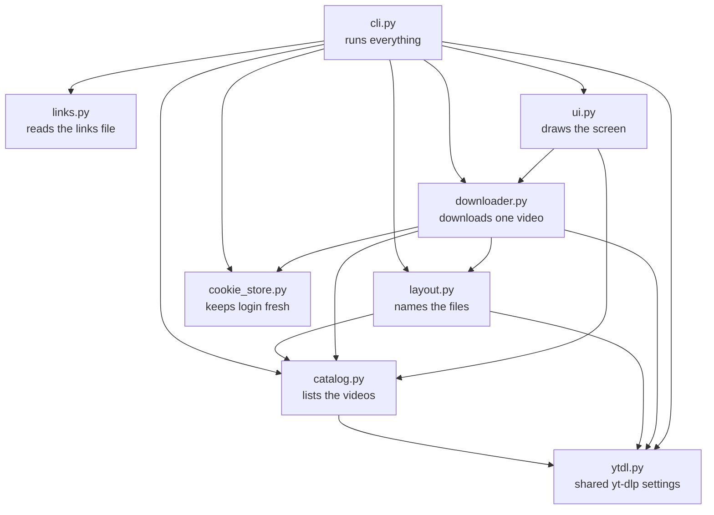
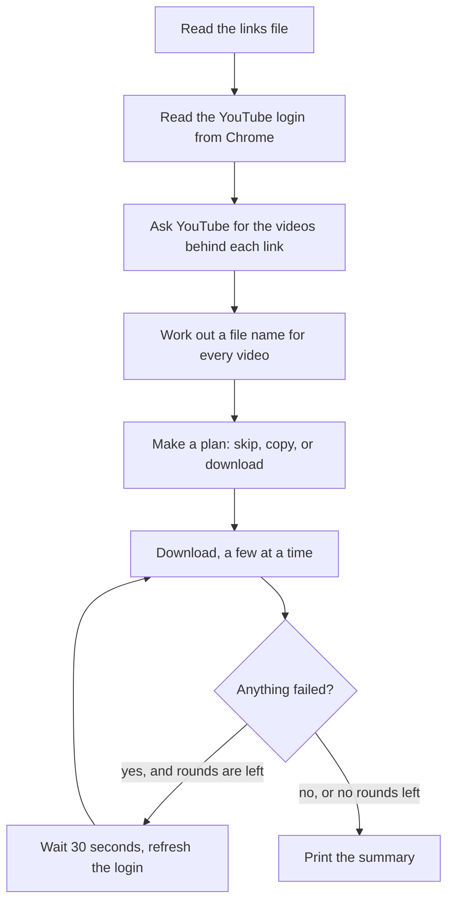

# How yt-dwnldr is built

yt-dwnldr saves YouTube playlists as mp4 files on a computer. It takes a text file of links, finds every video behind those links, downloads a few at a time, and shows each download on screen as it happens.

This page explains how the parts fit together. To read in detail, start with [WALKTHROUGH.md](WALKTHROUGH.md).

## What does the actual downloading

This project is not a YouTube downloader of its own. It uses **yt-dlp**, a well-known open-source tool that already knows how to talk to YouTube. The code here decides what to download, where to save it, and what to show on screen. yt-dlp does the talking to YouTube.

Three other pieces come in through uv, the tool that installs everything:

- **ffmpeg** joins a video's picture and sound into one mp4 file. YouTube sends them separately. It comes from the `imageio-ffmpeg` package.
- **Deno** runs a small JavaScript check that is built into YouTube's video player. yt-dlp needs it to get the video, and it comes from the `deno` package.
- **rich** draws the colored bars and tables in the terminal.

## The files

All the code lives in `src/yt_dwnldr/`. Each file has one job.

| File | What it does |
|---|---|
| `links.py` | Reads the links file and cleans the list |
| `ytdl.py` | Holds the yt-dlp settings every part shares, reads Chrome's login data, and turns yt-dlp errors into short messages |
| `cookie_store.py` | Keeps the login data fresh during a long run |
| `catalog.py` | Asks YouTube what videos are behind each link |
| `layout.py` | Decides the folder and file name for each video, and places copies |
| `downloader.py` | Downloads one video and reports its progress |
| `ui.py` | Draws everything on screen |
| `cli.py` | Reads the command, runs the steps in order, and decides when to retry |

This is who uses whom. An arrow means "uses". Almost every file also uses the `Video` record from `catalog.py`, which describes one video.



One rule matters here. `downloader.py` never talks to the screen. It only hands small progress reports to a function that `cli.py` gives it. `cli.py` passes those reports on to `ui.py`. That keeps the downloading and the drawing separate, so each one can be tested on its own.

## One run, step by step

This is what happens on `uv run yt-dwnldr links.txt`.



1. **Read the links file.** `links.py` splits it on commas and new lines. It drops blank lines, lines that start with `#`, and repeated links.
2. **Read the login.** `cli.py` reads the YouTube login from Chrome once and puts it in the cookie store. If there is no login, it prints a yellow warning and carries on. Public videos do not need one.
3. **List the videos.** `catalog.py` asks YouTube what is behind each link. A playlist link becomes a numbered list of videos. Any other link becomes one video. Nothing downloads yet.
4. **Name the files.** `layout.py` works out the full path of every video, like `High Level Design/007 - Some title.mp4`.
5. **Make a plan.** `cli.py` sorts every video into one of five groups:
   - **Already downloaded.** The file is already there. Skip it.
   - **Unavailable.** YouTube lists the video without a title, which means it was deleted or made private. Skip it.
   - **Copy now.** The same video is in two playlists, and one copy is already on disk. Place a copy in the other folder right away.
   - **Download.** Nothing is on disk yet. Download it once.
   - **Copy after download.** Once that download finishes, place a copy in every other playlist folder that has the same video.
6. **Download.** A few workers download at the same time. Each one takes the next video from the list. Each download gets a live bar.
7. **Retry rounds.** If any videos failed, the tool waits 30 seconds, refreshes the login, and tries them again. It does this up to 3 times.
8. **Summary.** A table shows how many videos were downloaded, copied, skipped, unavailable, and failed. The tool then exits with a code: `0` if everything worked, `1` if something still failed, `2` if the links file was missing or empty, and `130` if Ctrl+C was pressed.

## Several downloads at once

The tool uses a small pool of **workers**. A worker is a thread: a separate line of work that Python runs alongside the others. Three workers means three videos download at the same time. `--workers` sets any number from 1 to 8.

- **Each worker has its own copy of yt-dlp.** yt-dlp keeps track of the download it is working on, so two workers never share one.
- **Shared things are guarded.** The screen counters and the cookie store use a lock. A lock lets only one worker change something at a time.
- **Workers take short breaks.** After each finished download, a worker waits a random 3 to 8 seconds. Many fast requests from one account are what make YouTube start its bot check.

## Staying signed in

Some videos need a signed-in account. yt-dlp can use a YouTube login by reading Chrome's **cookies**. Cookies are small pieces of data a browser keeps, and they are how YouTube recognizes a signed-in account.

Two problems shaped this part.

1. **The Keychain.** On a Mac, Chrome locks its cookies with a password kept in the macOS Keychain. Every time a yt-dlp copy reads Chrome by itself, macOS may ask for permission again. With several workers, that meant several prompts, and a worker could hang waiting on one.
2. **YouTube swaps cookies.** While YouTube is open in Chrome, YouTube keeps replacing some login cookies with new ones. A copy taken at the start of a long run goes stale. Videos that need the login then start failing partway through, while public videos keep working. yt-dlp's own guide describes this too.

The fix is the **cookie store** in `cookie_store.py`. It is the only thing that reads Chrome, and every worker asks it for cookies.

- **It hands out text, not a Chrome connection.** The workers get the cookies as plain text, so no worker ever touches Chrome or the Keychain.
- **It re-reads Chrome when its copy is old.** If the last read is 2 minutes old or more, the next worker that asks gets a fresh read.
- **It re-reads before a retry.** When a download fails, the worker asks for fresh cookies before trying again. To avoid reading Chrome over and over, it waits at least 15 seconds between reads.
- **Every read has a version number.** A worker compares numbers to know whether its yt-dlp copy has the newest cookies. If not, it builds a new yt-dlp copy with them.

## When a download fails

A failure can be temporary (a stale cookie, a slow network) or permanent (a deleted video). The tool cannot tell which from the outside, so it tries again in two layers.

| Layer | Where | What happens |
|---|---|---|
| Attempts | `downloader.py` | Each video gets 3 attempts in a row. Between attempts, the bar says `retrying`, the worker waits 20 seconds, and it gets fresh cookies. |
| Rounds | `cli.py` | After the main pass, every video that still failed is tried again as a group. There are up to 3 rounds, 30 seconds apart, each with fresh cookies. |

Only a video that fails every attempt in every round counts as failed in the summary.

The cost is time. A video that is truly gone uses up all its attempts before it is reported. That is why the plan already skips videos that YouTube lists without a title. They are known to be gone, so they never reach the retry layers.

## Where files go

Every video path comes from one pattern:

```text
<output folder>/<playlist name>/<number> - <video title>.mp4
```

Single videos go into a `singles` folder with no number.

- **yt-dlp builds the names.** Titles can contain characters that are not allowed in file names, like `/` or `:`. yt-dlp replaces them with look-alike characters. `layout.py` asks yt-dlp to build each name the same way it will when it saves the file. The two always match.
- **"Already downloaded" means "the file is there".** There is no separate list of finished videos. Deleting a file makes the next run download it again.
- **Every playlist folder is complete.** When one video appears in two playlists, it downloads once. The other folder gets a **hard link** under its own number. A hard link shows the same file in two folders and uses no extra disk space. If a hard link is not possible (for example across two drives), the tool makes a normal copy instead.

## Stopping with Ctrl+C

Pressing Ctrl+C turns on a shared stop signal, called the stop flag here. Every worker can see it.

1. **No new videos start.** Waiting videos are dropped from the queue.
2. **Running downloads stop at their next progress update.** yt-dlp reports progress many times a second. The function that receives those reports checks the flag and stops the download.
3. **The summary still prints.** The tool exits with code `130` and says to run the same command to continue.

If Ctrl+C is pressed while the links are still being read, nothing has downloaded yet. The tool then exits with code `130` straight away, without a summary.

Ctrl+C also reaches ffmpeg and Deno, which are separate programs. They can fail with an error at that moment. The tool ignores any error that arrives after the stop flag is set, so no false failures show up.

Half-finished files stay on disk as `.part` files. yt-dlp continues them on the next run.

## The screen

`ui.py` draws two kinds of output.

- **Lines that stay.** Finished, skipped, copied, and failed videos print as normal lines that scroll up. Each has a colored mark: green `✔`, yellow `↷`, or red `✗`.
- **A live area at the bottom.** One bar per active download, plus an Overall bar. rich redraws this area in place many times a second.

Three details keep the screen tidy:

- **The live area is one column narrower than the window.** Terminals lose track of the cursor after a line that fills the full width. Old rows then pile up on screen.
- **Titles are shown exactly as written.** rich normally reads `[word]` as a color instruction. That is turned off for titles.
- **yt-dlp prints nothing.** yt-dlp gets a logger (an object that receives all of its messages) that throws every message away. Otherwise its own output would break the live area.

## Design choices, and why

| Chosen | Not chosen | Why |
|---|---|---|
| Use yt-dlp as a Python library | Run the yt-dlp program and read its printed output | The library hands over exact progress numbers. Nothing has to be read back out of printed text. |
| Install everything with uv | Install yt-dlp and ffmpeg separately with Homebrew | One `uv sync` sets everything up, and nothing lands outside the project and uv's own folders. |
| One cookie store that re-reads Chrome | Let each yt-dlp copy read Chrome | Avoids repeated Keychain prompts and stale logins. |
| Check the disk to see what is done | Keep a list of finished videos | The disk is always right. A list can drift from what is really there. |
| Hard links for shared videos | Download the same video twice | Saves time and disk space, and every playlist folder stays complete. |
| Retry any failure | Retry only certain error messages | Error wording changes over time. A plain retry does not depend on it. |
| 3 workers by default | Many workers | More downloads at once from one account make YouTube block the account sooner. |

## Where to change things

| To change... | Look in |
|---|---|
| The video quality | `FORMAT` in `downloader.py` |
| The file name pattern | `OUTPUT_TEMPLATE` in `layout.py` |
| How often the login is refreshed | `REFRESH_INTERVAL_SECONDS` in `cookie_store.py` |
| The number of attempts or rounds | `MAX_ATTEMPTS` in `downloader.py`, `RETRY_ROUNDS` in `cli.py` |
| The command options | `parse_args` in `cli.py` |
| Colors or wording on screen | `ui.py` |
| The browser the login is read from | `BROWSER` in `ytdl.py` |

## Tests

The tests live in `tests/`, one file per source file. Run them with `uv run pytest`. They cover the parts that need no network: reading links, naming files, planning, the cookie store's timing, the retry logic, and the screen text. The download itself is checked by hand with real runs, because it depends on YouTube.
