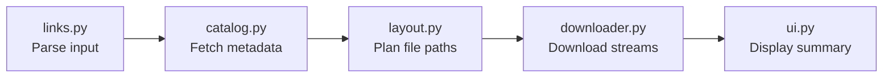

# Architecture

yt-dwnldr downloads playlists and videos from YouTube and other sites as mp4 files. It coordinates metadata extraction, parallel downloads, and file layout while yt-dlp handles each site's protocol.

## Core dependencies

- **yt-dlp.** Downloads video and audio streams from 1,700+ sites, plus embedded and direct video links.
- **imageio-ffmpeg.** Merges separate video and audio streams into single mp4 files, and converts non-mp4 sources to mp4.
- **rich.** Renders terminal progress bars, status tables, and styled logs.

## Module structure

All application code lives in `src/yt_dwnldr/`. Each module has a single responsibility.

| Module | Responsibility |
|---|---|
| `cli.py` | Command line entry point, workflow orchestration, and retry rounds. |
| `links.py` | Parses links files, strips comments, and removes duplicates. |
| `catalog.py` | Resolves any link into playlist or video metadata. |
| `layout.py` | Generates destination paths and manages hard links for duplicate videos. |
| `downloader.py` | Manages single-video downloads, stream merging, mp4 conversion, and worker pauses. |
| `cookie_store.py` | Extracts and caches Chrome session cookies across threads. |
| `ytdl.py` | Configures shared yt-dlp options and error message formatting. |
| `ui.py` | Renders terminal progress bars and final summary tables. |

## Execution pipeline

1. **Parse links.** Read URLs, strip empty lines and comments, and deduplicate entries.
2. **Resolve catalog.** yt-dlp detects the site from each link. Links that point to another page are followed, up to 3 hops. A playlist result on any site, including a page with several embedded videos, becomes a numbered folder. Anything else is a single video.
3. **Plan layout.** Check disk for existing files. Schedule new downloads, plan hard links for shared videos, and skip completed items.
4. **Download in parallel.** Worker threads pull from the queue, extract streams via yt-dlp, merge with ffmpeg, and report progress.
5. **Retry failures.** Failed downloads enter retry rounds with refreshed cookies.
6. **Report results.** Print final counts for downloaded, skipped, copied, and failed videos.

## Key design decisions

- **Centralized cookie store.** Chrome locks cookies in the macOS Keychain. Reading cookies once in `cookie_store.py` and sharing plain text across workers prevents repeated Keychain permission prompts.
- **Hard links for duplicates.** When a video appears in multiple playlists, it downloads once. Secondary locations receive a hard link, saving bandwidth and disk space.
- **Independent workers.** Each worker thread owns its own yt-dlp instance. Thread-safe locks protect only shared state, such as progress counters.
- **Two-layer retry strategy.** Downloads retry immediately after a 20-second pause. Any videos that still fail are retried together in up to 3 final rounds.
- **Disk-driven state.** The presence of a non-empty output file determines completion status. Deleting a file causes the next run to re-download it. An empty file, such as one left by a failed conversion, counts as not downloaded.
- **Site plus ID as the video key.** Two sites can use the same video ID, so videos are matched by both. This key drives duplicate detection and progress tracking.
- **Planned title names the file.** The file name uses the title read during planning, not the one yt-dlp sees at download time. Some sites return a different title later, which would break the completion check.
- **Always mp4.** Downloads prefer mp4 up to 1080p. A source with no mp4 is re-encoded to H.264 and AAC after download. Files already in mp4 are left untouched.
- **Embedded videos.** A video embedded in a page has no page of its own. Its media file address (preferring mp4) is used instead. An entry with no address at all is marked unavailable.
